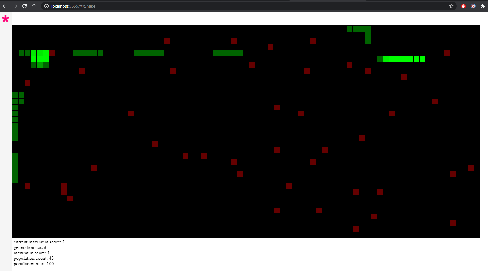

# SnakeAI
Snake game self played with genetic algorithm and neural network - NEAT. the game is developed using p5.js framework for the canvas and the game and the tensorflow.js library for the neural network.

## Installation:

### Required:

    npm

### Installing:
    git clone https://github.com/jonatan5524/SnakeAI
    cd SnakeAI
    npm install -g p5-manager
    p5 server

## Usage:
After running the local server for the snake AI, go to the address with the port that presented in the terminal and to the path Snake

## Example:

## Algorithm:
there are multiple snake game, as the number of population count, for each game there is a snake and an apple with its own score, for each snake there is a "brain" - a neural network that decide each turn what move to play.

### Neural Network

inputs:
* 0 or 1 if the block on the left is free
* 0 or 1 if the block on the right is free
* 0 or 1 if the block above is free
* 0 or 1 if the block below is free
* the angle to the apple
* suggestion what action to do

the suggestion is decided by where is the apple where need to turn.

outputs:
* turn left
* turn right
* defualt (dont turn)

### Genetic Algorithm 
* population: array of snake games.
* fitness: gitness is increased when the snake as eaten an apple and increase when the snake is moving toward the snake and decrease when the snake moving ןn the opposite direction of the apple.
* mutation: changing the weight of on the neural network by mutation rate.
* selection: the parent for the next generation is selected by the highest fitness.

there is one more factor for the snake, hunger, each turn the snake hunger is decreased and increased when the snake is eating an apple. 
